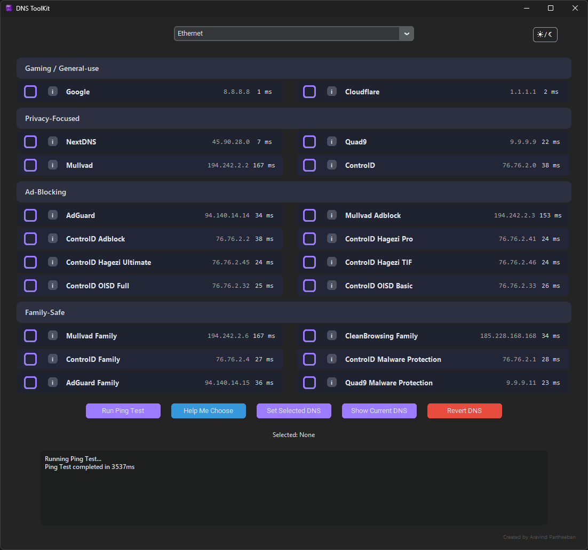
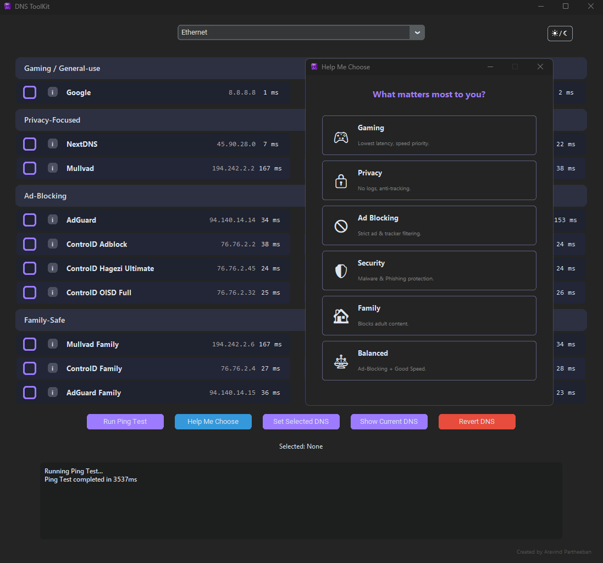

<link rel="stylesheet" href="assets/custom.css">

A lightweight Windows utility to <b>test, compare, and set DNS providers</b> — with built-in latency benchmarking and privacy-friendly defaults.

  <a class="btn" 
     href="https://github.com/aravindpartheeban/DNS-ToolKit/releases/latest/download/DNS-ToolKit.zip">
     ⬇ Download for Windows (.zip)
  </a>

---

<h2 align="center">🖥 App Screenshots</h2>

  

  

---

<h2 align="center">⭐ Why Use DNS Toolkit?</h2>

- Measure <b>real-world DNS latency</b> using parallel ping tests  
- <b>One-click DNS switching</b> for your selected network adapter  
- Built-in <b>DNS recommendation engine</b> (Gaming, Privacy, Security, Ad-Blocking, Family-Safe, Balanced)
- Supports DNS providers like <b>Cloudflare, Google, Quad9, Mullvad, NextDNS, AdGuard & ControlD</b>
- <b>Zero telemetry. Zero proxying. Local-only configuration.</b>

---

<h2 align="center">🔒 Private by Design</h2>

DNS Toolkit does <b>not</b> route or inspect DNS traffic and <b>does not collect analytics</b>.  
All DNS changes are applied locally using standard Windows networking commands.

---

<h2 align="center">🖥 Requirements</h2>

- Windows 10 or Windows 11  
- Administrator privileges to change DNS settings  
- Portable <code>.exe</code> — no installer required

---

  Made for developers, tweakers, gamers, privacy-nerds & network geeks 💜

